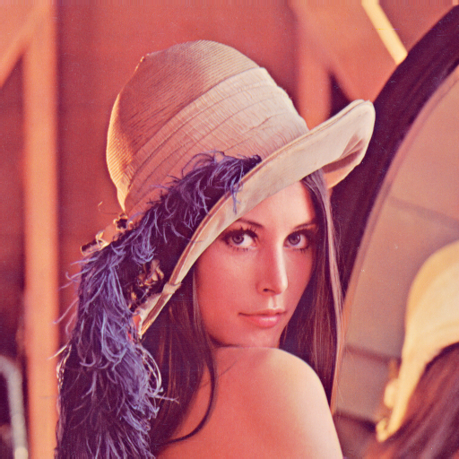

# FFmpeg Image Diff
A [NodeJS](https://nodejs.org/) image diffing library using
[FFmpeg](https://www.ffmpeg.org/).  
Creates an image showing perceptual differences and returns
[SSIM](https://en.wikipedia.org/wiki/Structural_similarity) data.

- [Requirements](#requirements)
- [Install](#install)
- [Usage](#usage)
- [Options](#options)
  * [ssim](#ssim)
  * [similarity](#similarity)
  * [blend](#blend)
  * [opacity](#opacity)
  * [color](#color)
- [Samples](#samples)
  * [Reference image](#reference-image)
  * [Comparison image](#comparison-image)
  * [Output image](#output-image)
- [Testing](#testing)
- [License](#license)
- [Author](#author)

## Requirements
This is a thin wrapper around [FFmpeg](https://www.ffmpeg.org/) and has no other
dependencies.

## Install

```sh
npm install ffmpeg-image-diff
```

## Usage

Displaying
[SSIM](https://en.wikipedia.org/wiki/Structural_similarity) data only:
```js
const imgDiff = require('ffmpeg-image-diff')

imgDiff(
  referenceImage,     // e.g. 'test/lenna.png'
  comparisonImage     // e.g. 'test/lenna-edit.png'
).then((ssim) => {
  // Sample output: { R: 0.990149, G: 0.991289, B: 0.990579, All: 0.990672 }
  console.log(ssim)
}).catch((error) => {
  console.error(error)
})
```

Creating a differential image with default options:
```js
const imgDiff = require('ffmpeg-image-diff')

imgDiff(
  referenceImage,     // e.g. 'test/lenna.png'
  comparisonImage,    // e.g. 'test/lenna-edit.png'
  outputImage,        // e.g. 'test/out.png', overwrites an existing file
  {
    ssim: true,       // true or false
    similarity: 0.01, // 1.0 - 0.01
    blend: 1.0,       // 1.0 - 0.0
    opacity: 0.1,     // 1.0 - 0.0
    color: 'magenta'  // magenta, yellow, cyan, red green, blue or ''
  }
).then((ssim) => {
  // Sample output: { R: 0.990149, G: 0.991289, B: 0.990579, All: 0.990672 }
  console.log(ssim)
}).catch((error) => {
  console.error(error)
})
```

## Options

### ssim
If set to `false`, disables
[SSIM](https://en.wikipedia.org/wiki/Structural_similarity) calculation.  
*Default:* `true`

### similarity
Defines the threshold to identify image differences.  
`0.01` matches slight differences, while `1.0` only matches stark contrast.  
*Range:* `1.0 - 0.01`  
*Default:* `0.01`

### blend
Blend percentage for the differential pixels.  
Higher values result in semi-transparent pixels, with a higher transparency the
more similar the pixels color is to the original color.  
*Range:* `1.0 - 0.0`  
*Default:* `1.0`

### opacity
Opacity of the reference image as backdrop for the differential image.  
Higher values result in a more opaque background image.  
*Range:* `1.0 - 0.0`  
*Default:* `0.1`

### color
The color balance of the differential pixels.  
An empty string displays the default differential pixels.  
*Set:* `['magenta', 'yellow', 'cyan', 'red', 'green', 'blue', '']`  
*Default:* `'magenta'`

## Samples

### Reference image


### Comparison image


### Output image


## Testing
1. Start [Docker](https://docs.docker.com/).
3. Install development dependencies:
   ```sh
   npm install
   ```
4. Run the tests:
   ```sh
   npm test
   ```

## License
Released under the [MIT license](https://opensource.org/licenses/MIT).

## Author
[Sebastian Tschan](https://blueimp.net/)
